# VEX V5 Robot - Mermaid Flowcharts

These diagrams can be rendered using any Mermaid-compatible viewer (GitHub, VS Code, etc.)

---

## 1. System Boot Sequence

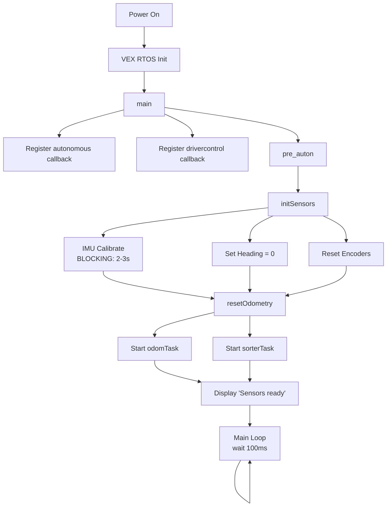

---

## 2. Competition State Machine

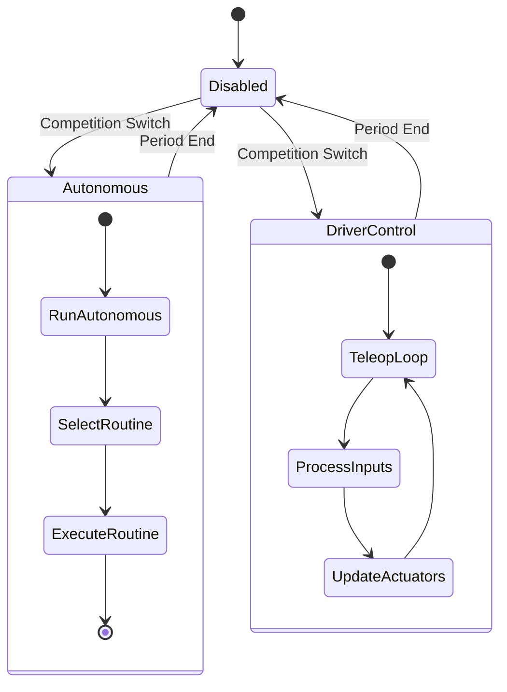

---

## 3. Odometry Task

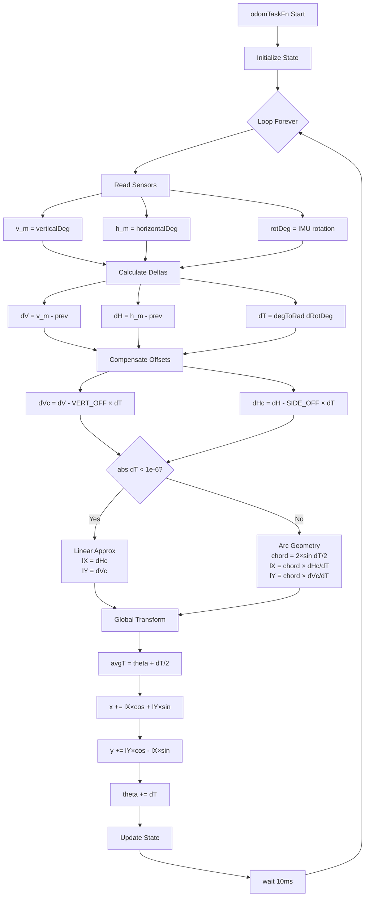

---

## 4. PID Controller Update

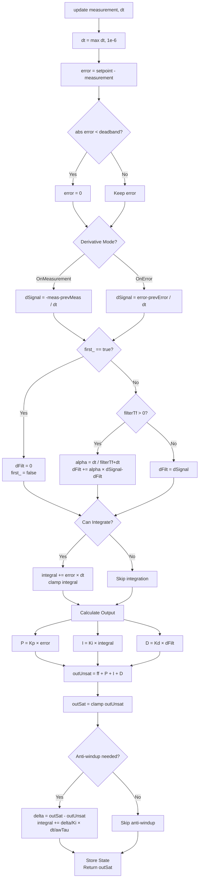

---

## 5. Motion Controller - drive

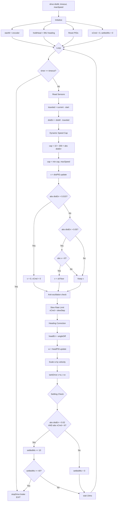

---

## 6. Motion Controller - turnTo

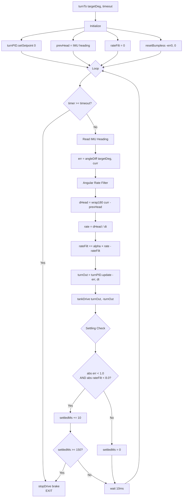

---

## 7. Auto-Correction System

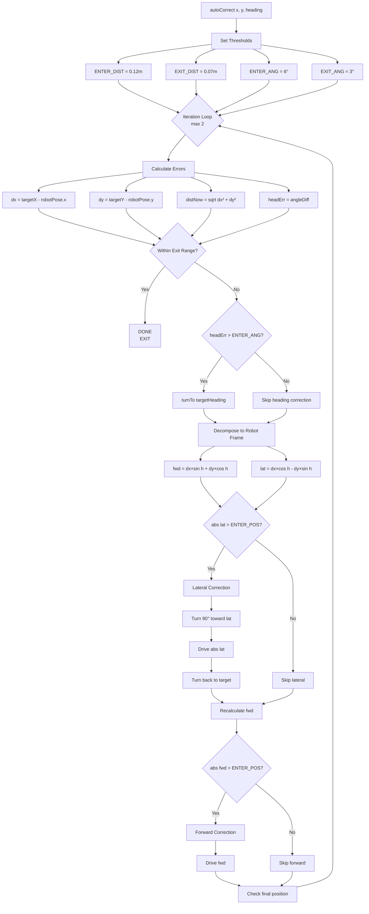

---

## 8. Teleop Main Loop

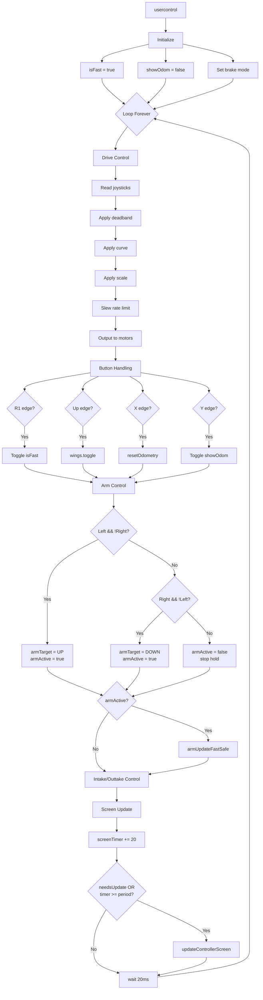

---

## 9. Arm Control Algorithm

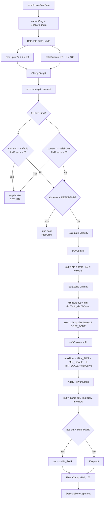

---

## 10. Color Sorting Task

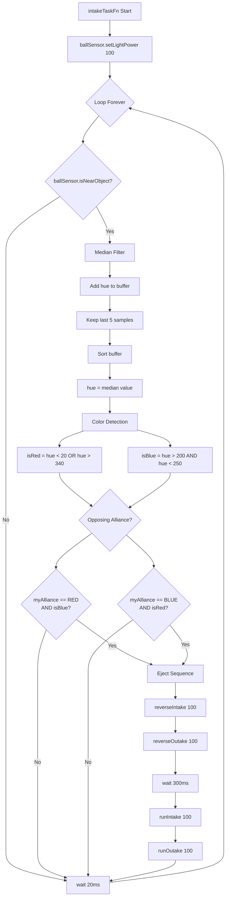

---

## 11. Slew Rate Limiter

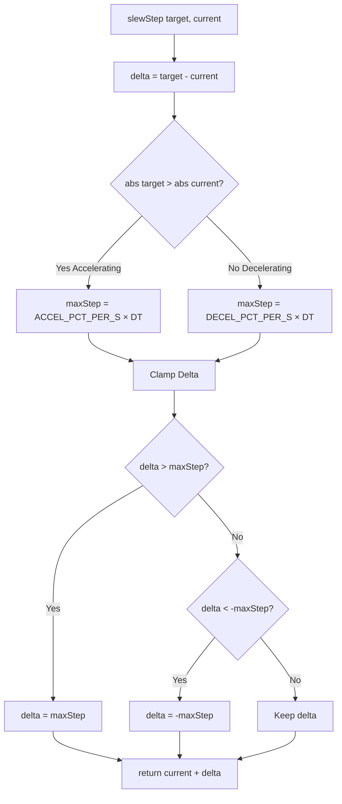

---

## Summary Timing Diagram

```mermaid
gantt
    title Task Timing (100ms window)
    dateFormat X
    axisFormat %L
    
    section Odometry
    Odom Update :a1, 0, 1
    Odom Update :a2, 10, 1
    Odom Update :a3, 20, 1
    Odom Update :a4, 30, 1
    Odom Update :a5, 40, 1
    Odom Update :a6, 50, 1
    Odom Update :a7, 60, 1
    Odom Update :a8, 70, 1
    Odom Update :a9, 80, 1
    Odom Update :a10, 90, 1
    
    section Color Sorter
    Sort Check :b1, 0, 2
    Sort Check :b2, 20, 2
    Sort Check :b3, 40, 2
    Sort Check :b4, 60, 2
    Sort Check :b5, 80, 2
    
    section Teleop
    Control Loop :c1, 0, 2
    Control Loop :c2, 20, 2
    Control Loop :c3, 40, 2
    Control Loop :c4, 60, 2
    Control Loop :c5, 80, 2
    
    section Main
    Watchdog :d1, 100, 1
```

---

*Mermaid Flowcharts for VEX V5 Competition Robot*
