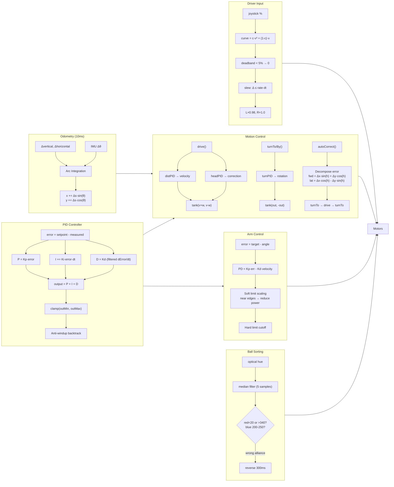

# VEX Robotics - Algorithm Flowmap

## Key Algorithms

| Algorithm | Formula/Logic |
|-----------|---------------|
| **Exponential Curve** | `out = c·v³ + (1-c)·v` where c=0.1 fwd, 0.3 turn |
| **Slew Rate** | `Δcmd ≤ 300%/s · dt` (accel/decel limited) |
| **Arc Odometry** | `chord = 2·sin(Δθ/2)`, integrate local→global |
| **PID** | `P + I + D` with derivative filter τ=0.05-0.10s |
| **Anti-windup** | Back-calculate integral on saturation |
| **Heading Hold** | Maintain heading during straight drive |
| **Auto-correct** | Decompose XY error into fwd/lateral, correct iteratively |
| **Arm Soft Limits** | `maxPower *= (dist/zone)²` near boundaries |
| **Ball Sort** | Median-filtered hue, alliance-based rejection |