# VEX V5 Robotics Codebase Flowmap

```mermaid
flowchart TB
    subgraph Entry["Program Entry"]
        main["main.cpp"]
        main -->|"Competition.autonomous()"| autoCallback["autonomous()"]
        main -->|"Competition.drivercontrol()"| driverCallback["usercontrol()"]
        main -->|"Initialize"| preAuton["pre_auton()"]
    end

    subgraph PreAuton["Pre-Autonomous Setup"]
        preAuton --> initSensors["initSensors()"]
        preAuton --> resetOdom["resetOdometry()"]
        preAuton --> startTasks["Start Tasks"]
        startTasks --> odomTask["odomTask 10ms"]
        startTasks --> sorterTask["intakeTaskFn()"]
    end

    subgraph Autonomous["Autonomous Mode"]
        autoCallback --> runAuton["runAutonomous()"]
        runAuton -->|"switch"| autonSelect{Routine?}
        autonSelect --> blueRight["blueRight()"]
        autonSelect --> acBlueRight["autoCorrectBlueRight()"]
        autonSelect --> acRedLeft["autoCorrectRedLeft()"]
        autonSelect --> otherAutons["...others"]
        
        blueRight --> MC
        acBlueRight --> MC
        acRedLeft --> MC
    end

    subgraph MotionControl["Motion Controller"]
        MC["MotionController"]
        MC --> drive["drive()"]
        MC --> turnTo["turnTo()"]
        MC --> turnBy["turnBy()"]
        MC --> autoCorrect["autoCorrect()"]
        
        MC --> driveAC["driveAC()"]
        MC --> turnToAC["turnToAC()"]
        MC --> turnByAC["turnByAC()"]
        
        driveAC --> drive
        driveAC --> autoCorrect
        turnToAC --> turnTo
        turnToAC --> autoCorrect
        turnByAC --> turnBy
        turnByAC --> autoCorrect
        autoCorrect --> drive
        autoCorrect --> turnTo
    end

    subgraph PID["PID Controllers"]
        distPID["distPID_"]
        headPID["headPID_"]
        turnPID["turnPID_"]
        
        drive --> distPID
        drive --> headPID
        turnTo --> turnPID
        turnBy --> turnPID
    end

    subgraph DriveLayer["Drive Functions"]
        tankDrive["tankDrive()"]
        stopDrive["stopDrive()"]
        
        drive --> tankDrive
        turnTo --> tankDrive
        turnBy --> tankDrive
        drive --> stopDrive
        turnTo --> stopDrive
        turnBy --> stopDrive
    end

    subgraph Manual["Driver Control"]
        driverCallback --> userLoop["usercontrol() 20ms loop"]
        
        userLoop --> joystick["Joystick Input"]
        joystick --> curves["Exp Curves"]
        curves --> slew["Slew Rate"]
        slew --> tankDrive
        
        userLoop --> buttons["Button Handlers"]
        buttons --> R1["R1: Speed Toggle"]
        buttons --> Up["Up: Wings"]
        buttons --> X["X: Reset Odom"]
        buttons --> Y["Y: Odom Display"]
        buttons --> LR["L/R: Arm"]
        
        userLoop --> armCtrl["Arm PD Control"]
    end

    subgraph Subsystems["Subsystems"]
        wings["Wings"]
        intake["Intake"]
        outtake["Outtake"]
        
        userLoop --> wings
        userLoop --> intake
        userLoop --> outtake
        acBlueRight --> intake
        acBlueRight --> outtake
        acBlueRight --> wings
    end

    subgraph Odometry["Odometry"]
        odomTask --> odomLoop["odomLoop()"]
        odomLoop --> robotPose["robotPose {x,y,θ}"]
        robotPose --> autoCorrect
        robotPose --> driveAC
    end

    subgraph BallSort["Ball Sorting"]
        sorterTask --> sortLoop["Color Detection"]
        sortLoop -->|"Wrong color"| eject["Eject"]
        eject --> intake
        eject --> outtake
    end

    subgraph Hardware["Hardware"]
        motors["Motors"]
        sensors["Sensors"]
        pneum["Pneumatics"]
        
        tankDrive --> motors
        armCtrl --> motors
        intake --> motors
        outtake --> motors
        wings --> pneum
        odomLoop --> sensors
        sortLoop --> sensors
    end
```

## Module Descriptions

| Module | File | Purpose |
|--------|------|---------|
| Entry | `main.cpp` | Competition callbacks, main loop |
| Pre-Auton | `pre_auton.cpp` | Sensor init, start background tasks |
| Autonomous | `autons.cpp` | Match routines |
| Motion | `motion.cpp` | PID-based movement functions |
| Drive | `drive.cpp` | Low-level motor commands |
| Manual | `manual.cpp` | Driver control loop |
| Odometry | `odom.cpp` | Position tracking |
| Subsystems | `subsystems.cpp` | Wings, intake, outtake |
| Config | `robot_config.cpp` | Hardware definitions |
| PID | `PID.h` | Reusable PID controller class |
